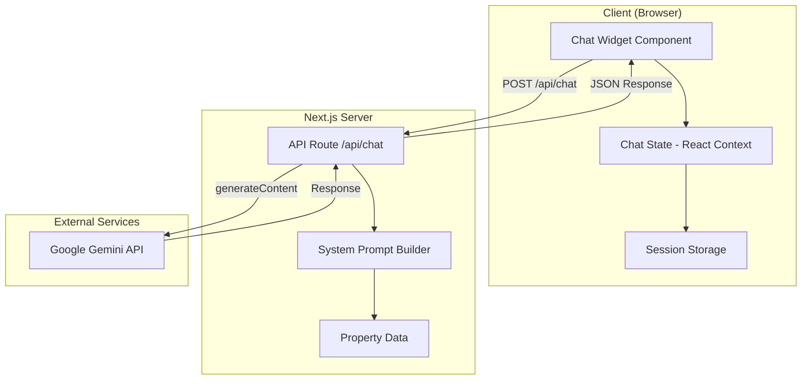

# Design Document: AI Chatbot

## Overview

This design document outlines the architecture and implementation approach for integrating an AI-powered chatbot into the RD Realty website using Google Gemini API. The chatbot will be implemented as a client-side React component with a server-side Next.js API route for secure communication with the Gemini API.

## Architecture



## Components and Interfaces

### 1. Chat Widget Component (`components/chat-widget.tsx`)

The main UI component that renders the floating chat button and expandable chat interface.

```typescript
interface ChatWidgetProps {
  // No props needed - self-contained component
}

interface ChatWidgetState {
  isOpen: boolean;
  messages: Message[];
  inputValue: string;
  isLoading: boolean;
  error: string | null;
}
```

**Responsibilities:**
- Render floating action button (FAB) in bottom-right corner
- Display floating label near FAB prompting users to click (e.g., "Click here for assistant")
- Hide floating label when chat panel is open
- Toggle chat panel open/closed
- Display header with assistant name "Rea"
- Show welcome greeting "Hi, I'm Rea..." when chat opens with no messages
- Display message history with user/assistant distinction
- Handle message input and submission
- Show loading states during API calls
- Display error messages with retry option

### 2. Chat Context Provider (`components/chat-provider.tsx`)

React Context for managing chat state across page navigations.

```typescript
interface Message {
  id: string;
  role: 'user' | 'assistant';
  content: string;
  timestamp: Date;
}

interface ChatContextValue {
  messages: Message[];
  isOpen: boolean;
  isLoading: boolean;
  error: string | null;
  sendMessage: (content: string) => Promise<void>;
  toggleChat: () => void;
  clearError: () => void;
}
```

**Responsibilities:**
- Maintain conversation state in React Context
- Persist messages to sessionStorage for navigation persistence
- Provide sendMessage function for API communication
- Handle loading and error states

### 3. API Route (`app/api/chat/route.ts`)

Server-side endpoint for secure Gemini API communication.

```typescript
interface ChatRequest {
  message: string;
  history: Array<{
    role: 'user' | 'assistant';
    content: string;
  }>;
}

interface ChatResponse {
  success: boolean;
  message?: string;
  error?: string;
}
```

**Responsibilities:**
- Validate incoming requests
- Build system prompt with property context
- Call Gemini API with conversation history
- Handle API errors and return appropriate responses
- Protect API key from client exposure

### 4. System Prompt Builder (`lib/chatbot-prompt.ts`)

Utility for constructing the system prompt with property knowledge.

```typescript
function buildSystemPrompt(): string;
function formatPropertyContext(): string;
```

**Responsibilities:**
- Define chatbot personality and behavior guidelines
- Include comprehensive property information
- Set conversation boundaries
- Provide leasing process information
- Include contact details

## Data Models

### Message Model

```typescript
interface Message {
  id: string;           // Unique identifier (UUID)
  role: 'user' | 'assistant';
  content: string;      // Message text content
  timestamp: Date;      // When message was created
}
```

### Chat Session Model (Client-side only)

```typescript
interface ChatSession {
  messages: Message[];
  createdAt: Date;
  lastActivity: Date;
}
```

### API Request/Response Models

```typescript
// Request to /api/chat
interface ChatAPIRequest {
  message: string;
  history: HistoryEntry[];
}

interface HistoryEntry {
  role: 'user' | 'assistant';
  content: string;
}

// Response from /api/chat
interface ChatAPIResponse {
  success: boolean;
  message?: string;
  error?: string;
}
```


## Correctness Properties

*A property is a characteristic or behavior that should hold true across all valid executions of a system—essentially, a formal statement about what the system should do. Properties serve as the bridge between human-readable specifications and machine-verifiable correctness guarantees.*

### Property 1: Widget Toggle State Consistency

*For any* sequence of toggle operations on the Chat_Widget, the isOpen state should alternate between true and false, and clicking the widget button should always result in the opposite state.

**Validates: Requirements 1.2**

### Property 2: Floating Label Visibility

*For any* state of the Chat_Widget, the floating label should be visible when isOpen is false and hidden when isOpen is true.

**Validates: Requirements 1.6, 1.7**

### Property 3: Message History Preservation

*For any* sequence of messages added to a Chat_Session, all messages should be retrievable in the same order they were added, and closing/reopening the widget should not affect the message history.

**Validates: Requirements 2.2, 2.3, 2.4**

### Property 4: Empty Message Rejection

*For any* string composed entirely of whitespace characters (including empty string), attempting to send it as a message should be rejected, and the messages array should remain unchanged.

**Validates: Requirements 3.2**

### Property 5: Message Transmission Integrity

*For any* valid (non-empty, non-whitespace) message, sending it should result in the message being added to the history and an API call being made with the message content and conversation history.

**Validates: Requirements 3.1, 3.4**

### Property 6: API Error Handling

*For any* API error response, the chatbot should set an error state with a user-friendly message and not add any assistant message to the history.

**Validates: Requirements 3.5, 8.3**

### Property 7: System Prompt Completeness

*For any* API request to the chat endpoint, the system prompt should contain all property names from the property data, contact information, and conversation boundary instructions.

**Validates: Requirements 4.1, 8.4**

### Property 8: Request Validation

*For any* request to the chat API route, requests missing the required 'message' field or with an invalid message type should be rejected with a 400 status code.

**Validates: Requirements 8.2**

## Error Handling

### Client-Side Errors

| Error Type | Handling Strategy |
|------------|-------------------|
| Network failure | Display "Unable to connect. Please check your internet connection." with retry button |
| API timeout | Display "Request timed out. Please try again." with retry button |
| Invalid response | Display "Something went wrong. Please try again." with retry button |

### Server-Side Errors

| Error Type | HTTP Status | Response |
|------------|-------------|----------|
| Missing message field | 400 | `{ success: false, error: "Message is required" }` |
| Invalid message type | 400 | `{ success: false, error: "Invalid message format" }` |
| Missing API key | 500 | `{ success: false, error: "Chat service is not configured" }` |
| Gemini API error | 500 | `{ success: false, error: "Unable to process your request" }` |
| Rate limiting | 429 | `{ success: false, error: "Too many requests. Please wait a moment." }` |

### Error Recovery

1. All errors display a retry button
2. Error state is cleared when user sends a new message
3. Failed messages are not added to history
4. Loading state is always cleared after request completes (success or failure)

## Testing Strategy

### Unit Tests

Unit tests will verify specific examples and edge cases:

1. **Chat Widget Component**
   - Renders floating button in correct position
   - Displays floating label with "Click here for assistant" text when closed
   - Hides floating label when chat is open
   - Opens/closes on button click
   - Displays header with assistant name "Rea"
   - Shows welcome greeting "Hi, I'm Rea..." when opened with no messages
   - Displays close button when open
   - Shows loading indicator during API call
   - Displays error message on failure

2. **Chat Context**
   - Initializes with empty messages
   - Adds messages correctly
   - Persists to sessionStorage
   - Restores from sessionStorage

3. **API Route**
   - Returns 400 for missing message
   - Returns 400 for empty message
   - Returns 500 for missing API key
   - Returns success response with message

4. **System Prompt Builder**
   - Includes all property names
   - Includes contact information
   - Includes conversation boundaries

### Property-Based Tests

Property-based tests will use a testing library (fast-check for TypeScript) to verify universal properties across many generated inputs. Each test will run a minimum of 100 iterations.

1. **Property 1: Widget Toggle State Consistency**
   - Generate random sequences of toggle operations
   - Verify state alternates correctly
   - Tag: **Feature: ai-chatbot, Property 1: Widget Toggle State Consistency**

2. **Property 2: Floating Label Visibility**
   - Generate random toggle states
   - Verify label visibility matches inverse of isOpen state
   - Tag: **Feature: ai-chatbot, Property 2: Floating Label Visibility**

3. **Property 3: Message History Preservation**
   - Generate random message sequences
   - Verify all messages preserved after operations
   - Tag: **Feature: ai-chatbot, Property 3: Message History Preservation**

4. **Property 4: Empty Message Rejection**
   - Generate whitespace-only strings of various lengths
   - Verify all are rejected
   - Tag: **Feature: ai-chatbot, Property 4: Empty Message Rejection**

5. **Property 5: Message Transmission Integrity**
   - Generate valid message strings
   - Verify message added and API called
   - Tag: **Feature: ai-chatbot, Property 5: Message Transmission Integrity**

6. **Property 6: API Error Handling**
   - Generate various error responses
   - Verify error state set correctly
   - Tag: **Feature: ai-chatbot, Property 6: API Error Handling**

7. **Property 7: System Prompt Completeness**
   - Verify prompt contains all required elements
   - Tag: **Feature: ai-chatbot, Property 7: System Prompt Completeness**

8. **Property 8: Request Validation**
   - Generate invalid request payloads
   - Verify all rejected with 400
   - Tag: **Feature: ai-chatbot, Property 8: Request Validation**

### Testing Tools

- **Jest**: Test runner and assertion library
- **React Testing Library**: Component testing
- **fast-check**: Property-based testing library for TypeScript
- **MSW (Mock Service Worker)**: API mocking for integration tests

### Test Configuration

```typescript
// fast-check configuration
fc.configureGlobal({
  numRuns: 100,  // Minimum iterations per property test
  verbose: true
});
```
