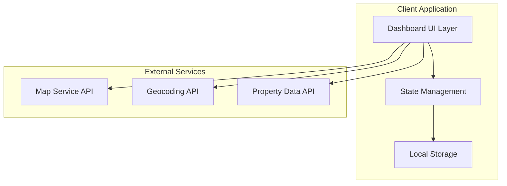
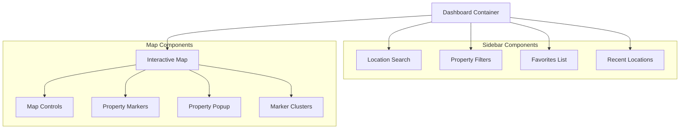

# Design Document: Locations Dashboard Redesign

## Overview

This design transforms the existing basic "Our Locations" map interface into a comprehensive, modern dashboard that matches the Square UI maps template aesthetic. The redesign follows contemporary dashboard design patterns with a sidebar-based layout, enhanced interactivity, and professional-grade functionality for real estate property exploration.

The solution leverages shadcn/ui components for consistent modern styling, implements responsive design principles, and provides advanced features like search, favorites, and filtering that are essential for effective property discovery.

## Architecture

### High-Level Architecture



### Component Architecture



## Components and Interfaces

### Dashboard Container Component

**Purpose**: Main layout container managing sidebar and map layout
**Technology**: React component with shadcn/ui layout primitives

```typescript
interface DashboardProps {
  initialProperties: Property[]
  mapConfig: MapConfiguration
}

interface DashboardState {
  sidebarCollapsed: boolean
  activeView: 'search' | 'favorites' | 'recents' | 'filters'
  selectedProperty: Property | null
  mapViewport: MapViewport
}
```

### Sidebar Component System

**Purpose**: Left panel containing all navigation and control elements
**Technology**: shadcn/ui Sidebar component with responsive behavior

```typescript
interface SidebarProps {
  collapsed: boolean
  onToggle: () => void
  activeView: string
  onViewChange: (view: string) => void
}

// Sub-components
interface SearchComponentProps {
  onSearch: (query: string) => void
  onLocationSelect: (location: Location) => void
  searchHistory: SearchHistoryItem[]
}

interface FiltersComponentProps {
  filters: PropertyFilters
  onFiltersChange: (filters: PropertyFilters) => void
  propertyCount: number
}

interface FavoritesComponentProps {
  favorites: Property[]
  onFavoriteSelect: (property: Property) => void
  onFavoriteRemove: (propertyId: string) => void
}

interface RecentsComponentProps {
  recentLocations: RecentLocation[]
  onRecentSelect: (location: RecentLocation) => void
  onClearHistory: () => void
}
```

### Interactive Map Component

**Purpose**: Main map display with enhanced controls and property visualization
**Technology**: Leaflet with custom controls and clustering

```typescript
interface MapComponentProps {
  properties: Property[]
  viewport: MapViewport
  onViewportChange: (viewport: MapViewport) => void
  selectedProperty: Property | null
  onPropertySelect: (property: Property) => void
  mapStyle: 'street' | 'satellite' | 'hybrid'
  onStyleChange: (style: string) => void
}

interface MapControlsProps {
  onZoomIn: () => void
  onZoomOut: () => void
  onResetView: () => void
  onToggleFullscreen: () => void
  onToggleStyle: () => void
  onLocateUser: () => void
  fullscreenActive: boolean
  currentStyle: string
}
```

### Property Display Components

**Purpose**: Enhanced property visualization and interaction
**Technology**: Custom markers with clustering and responsive popups

```typescript
interface PropertyMarkerProps {
  property: Property
  onClick: (property: Property) => void
  onFavoriteToggle: (property: Property) => void
  isFavorite: boolean
  isSelected: boolean
}

interface PropertyPopupProps {
  property: Property
  onClose: () => void
  onFavoriteToggle: () => void
  onShare: () => void
  onViewDetails: () => void
  isFavorite: boolean
}

interface MarkerClusterProps {
  properties: Property[]
  bounds: LatLngBounds
  onClick: () => void
  count: number
}
```

## Data Models

### Core Data Structures

```typescript
interface Property {
  id: string
  title: string
  address: string
  coordinates: {
    lat: number
    lng: number
  }
  price: number
  type: 'residential' | 'commercial' | 'land'
  features: PropertyFeature[]
  images: string[]
  description: string
  createdAt: Date
  updatedAt: Date
}

interface PropertyFeature {
  id: string
  name: string
  category: 'amenity' | 'specification' | 'location'
  value?: string | number
}

interface PropertyFilters {
  type: PropertyType[]
  priceRange: {
    min: number
    max: number
  }
  features: string[]
  location?: {
    center: LatLng
    radius: number
  }
}

interface SearchHistoryItem {
  id: string
  query: string
  timestamp: Date
  resultCount: number
  location?: LatLng
}

interface RecentLocation {
  id: string
  property?: Property
  searchQuery?: string
  location: LatLng
  timestamp: Date
  type: 'property_view' | 'search' | 'location_browse'
}

interface MapViewport {
  center: LatLng
  zoom: number
  bounds: LatLngBounds
}

interface MapConfiguration {
  defaultCenter: LatLng
  defaultZoom: number
  maxZoom: number
  minZoom: number
  clusterDistance: number
  tileLayerUrls: {
    street: string
    satellite: string
    hybrid: string
  }
}
```

### State Management Structure

```typescript
interface ApplicationState {
  // UI State
  sidebar: {
    collapsed: boolean
    activeView: SidebarView
  }
  map: {
    viewport: MapViewport
    style: MapStyle
    fullscreen: boolean
  }
  
  // Data State
  properties: {
    all: Property[]
    filtered: Property[]
    loading: boolean
    error: string | null
  }
  
  // User State
  favorites: {
    items: Property[]
    loading: boolean
  }
  recents: {
    locations: RecentLocation[]
    searches: SearchHistoryItem[]
  }
  
  // Filter State
  filters: PropertyFilters
  search: {
    query: string
    suggestions: SearchSuggestion[]
    loading: boolean
  }
}
```

## Correctness Properties

*A property is a characteristic or behavior that should hold true across all valid executions of a system—essentially, a formal statement about what the system should do. Properties serve as the bridge between human-readable specifications and machine-verifiable correctness guarantees.*

Now I need to analyze the acceptance criteria to determine which ones can be tested as properties. Let me use the prework tool:

### Property 1: Responsive Layout Adaptation
*For any* viewport dimensions, the dashboard should adapt its layout appropriately - displaying two-column layout with minimum 320px sidebar width for desktop sizes, and single-column layout for mobile sizes
**Validates: Requirements 1.2, 1.3**

### Property 2: Search Autocomplete Functionality
*For any* search query input, the location search should provide relevant autocomplete suggestions for addresses and neighborhoods
**Validates: Requirements 2.1**

### Property 3: Search Selection Navigation
*For any* selected search suggestion, the dashboard should center the map on the corresponding location and display relevant properties in that area
**Validates: Requirements 2.2**

### Property 4: Search-Based Property Filtering
*For any* property search criteria, the location search should filter visible property markers to show only properties matching the specified criteria
**Validates: Requirements 2.3**

### Property 5: Search History Persistence
*For any* search query performed, the location search should maintain the query in search history for future reference
**Validates: Requirements 2.4**

### Property 6: Search Result Visual Highlighting
*For any* displayed search results, matching properties should be visually distinguished with distinct styling from non-matching properties
**Validates: Requirements 2.5**

### Property 7: Favorites Addition
*For any* property with a favorite button, clicking the button should add the property to the user's favorites list
**Validates: Requirements 3.1**

### Property 8: Favorites Display Completeness
*For any* saved favorites, the favorites list should display all saved properties with thumbnail images and basic property details
**Validates: Requirements 3.2**

### Property 9: Favorites Navigation
*For any* property in the favorites list, clicking on it should center the map on that property and display its detailed information
**Validates: Requirements 3.3**

### Property 10: Favorites Removal Responsiveness
*For any* property removed from favorites, the favorites list should update immediately to reflect the removal
**Validates: Requirements 3.4**

### Property 11: Data Persistence Across Sessions
*For any* favorites or recent locations data, the information should persist in local storage and be available across browser sessions
**Validates: Requirements 3.5, 4.4**

### Property 12: Activity Tracking with Timestamps
*For any* user activity (property view or search), the recent locations system should record the activity with an accurate timestamp
**Validates: Requirements 4.1**

### Property 13: Recent Locations Display Limit
*For any* recent locations list access, the system should display exactly the 10 most recent activities, ordered by timestamp
**Validates: Requirements 4.2**

### Property 14: Recent Location Navigation
*For any* recent location item clicked, the dashboard should navigate to that location and restore the previous view state
**Validates: Requirements 4.3**

### Property 15: Recent History Clearing
*For any* clear history action, the recent locations system should remove all stored recent activities completely
**Validates: Requirements 4.5**

### Property 16: Fullscreen Mode Expansion
*For any* fullscreen toggle activation, the dashboard should expand the map to fill the entire viewport dimensions
**Validates: Requirements 5.2**

### Property 17: Map Layer Switching
*For any* map layer control interaction, the dashboard should switch between map styles (street, satellite, hybrid) and update the display immediately
**Validates: Requirements 5.3, 5.4**

### Property 18: User Location Centering
*For any* current location button click, the map should center on the user's geographical location when location access is available
**Validates: Requirements 5.5**

### Property 19: Filter-Based Property Visibility
*For any* applied property filters, the dashboard should update visible property markers to show only properties matching all active filter criteria
**Validates: Requirements 6.4**

### Property 20: Filter Result Count Accuracy
*For any* filter configuration, the property filter should display an accurate count of visible properties matching the current filter settings
**Validates: Requirements 6.5**

### Property 21: Property Marker Popup Display
*For any* property marker clicked, the property popup should display enhanced details including images, price, and key features
**Validates: Requirements 7.1**

### Property 22: Property Clustering with Count Display
*For any* map area with multiple properties in close proximity, the dashboard should show cluster markers with accurate property counts
**Validates: Requirements 7.3**

### Property 23: Property Marker Hover Tooltips
*For any* property marker hovered, the dashboard should display a preview tooltip containing basic property information
**Validates: Requirements 7.4**

### Property 24: Popup Responsive Adaptation
*For any* screen size, the property popup should adapt its layout and dimensions to fit appropriately within the viewport
**Validates: Requirements 7.5**

### Property 25: Asynchronous Data Loading
*For any* dashboard initialization, property data should load asynchronously without blocking user interface interactions
**Validates: Requirements 8.1**

### Property 26: High-Density Area Clustering
*For any* map area with high property density, the dashboard should implement marker clustering instead of displaying overlapping individual markers
**Validates: Requirements 8.2**

### Property 27: Viewport-Based Dynamic Loading
*For any* map viewport change, the dashboard should load additional properties within the newly visible area
**Validates: Requirements 8.3**

### Property 28: Property Data Caching
*For any* repeated request for the same property data, the dashboard should serve cached data to minimize redundant API calls
**Validates: Requirements 8.4**

### Property 29: Loading State Indicators
*For any* property data loading operation, the dashboard should display appropriate loading indicators to inform users of the loading state
**Validates: Requirements 8.5**

## Error Handling

### Input Validation and Sanitization

**Search Input Handling**:
- Sanitize search queries to prevent XSS attacks
- Handle empty or invalid search inputs gracefully
- Provide meaningful error messages for failed searches
- Implement debouncing to prevent excessive API calls

**Filter Input Validation**:
- Validate price range inputs for logical consistency (min ≤ max)
- Handle invalid filter combinations gracefully
- Provide clear feedback when no properties match filters
- Reset filters to valid state when conflicts occur

### API Error Handling

**Property Data Loading**:
- Implement retry logic for failed property data requests
- Display user-friendly error messages for network failures
- Provide fallback behavior when property images fail to load
- Handle partial data loading scenarios gracefully

**Geocoding and Map Services**:
- Handle geocoding API failures with fallback search methods
- Manage map tile loading errors with alternative tile sources
- Implement timeout handling for slow API responses
- Provide offline indicators when services are unavailable

### State Management Error Recovery

**Local Storage Failures**:
- Handle quota exceeded errors for local storage
- Provide graceful degradation when local storage is unavailable
- Implement data corruption detection and recovery
- Clear corrupted data and reinitialize with defaults

**Component Error Boundaries**:
- Implement React error boundaries for component failures
- Provide fallback UI for crashed components
- Log errors for debugging while maintaining user experience
- Allow users to recover from error states

## Testing Strategy

### Dual Testing Approach

The testing strategy employs both unit testing and property-based testing to ensure comprehensive coverage:

**Unit Tests**: Focus on specific examples, edge cases, and error conditions including:
- Component rendering with specific props
- User interaction handlers (clicks, form submissions)
- Error boundary behavior
- Integration points between components
- Edge cases like empty data sets or network failures

**Property Tests**: Verify universal properties across all inputs including:
- Responsive layout behavior across viewport ranges
- Search and filtering functionality with various inputs
- Data persistence and state management consistency
- Map interaction behaviors with different property datasets
- Performance characteristics under various load conditions

### Property-Based Testing Configuration

**Testing Library**: Use `@fast-check/jest` for TypeScript/React property-based testing
**Test Configuration**: Each property test runs minimum 100 iterations to ensure comprehensive input coverage
**Test Tagging**: Each property test includes a comment referencing its design document property:

```typescript
// Feature: locations-dashboard-redesign, Property 1: Responsive Layout Adaptation
test('dashboard adapts layout based on viewport dimensions', () => {
  fc.assert(fc.property(
    fc.record({
      width: fc.integer(320, 2560),
      height: fc.integer(480, 1440)
    }),
    (viewport) => {
      // Test implementation
    }
  ), { numRuns: 100 });
});
```

**Property Test Categories**:
1. **Layout Properties**: Responsive behavior, component positioning, visual hierarchy
2. **Interaction Properties**: User actions, state changes, navigation flows
3. **Data Properties**: Persistence, filtering, search functionality
4. **Performance Properties**: Loading behavior, caching, API efficiency

**Unit Test Focus Areas**:
- Specific user scenarios and workflows
- Error conditions and edge cases
- Component integration points
- Accessibility compliance
- Cross-browser compatibility

### Testing Implementation Requirements

Each correctness property must be implemented as a single property-based test that validates the universal behavior described in the property statement. Unit tests complement property tests by covering specific examples and integration scenarios that demonstrate correct system behavior in concrete use cases.